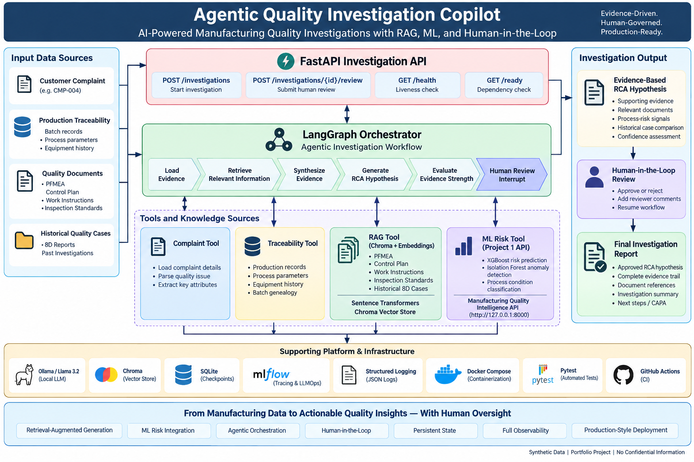

# Agentic Quality Investigation Copilot

An enterprise-style **Agentic AI system for manufacturing quality investigations** that combines Retrieval-Augmented Generation (RAG), machine-learning risk assessment, production traceability, LangGraph orchestration, human-in-the-loop review, MLflow observability, FastAPI, and Docker.

> **Portfolio Disclaimer:** All complaint records, traceability data, quality documents, historical cases, and evaluation datasets used in this repository are synthetic and created exclusively for learning and portfolio demonstration. No confidential employer, customer, or production data is included.

---
## Architecture


## Project Overview


## Project Highlights

- Built an end-to-end Agentic AI workflow for manufacturing quality investigation using LangGraph.
- Combined RAG, traceability data, historical quality cases, and ML-generated process-risk signals.
- Integrated a separate XGBoost + Isolation Forest quality-risk API as an agent tool.
- Implemented evidence-grounded RCA hypothesis generation with explicit human approval before final reporting.
- Added persistent LangGraph checkpointing using SQLite so interrupted investigations can resume after restart.
- Instrumented LLM, retrieval, ML-tool, and workflow execution using MLflow tracing.
- Added structured JSON logging, FastAPI APIs, readiness/liveness checks, Docker Compose, Pytest, and GitHub Actions CI.
- Evaluated the end-to-end workflow using a synthetic five-case benchmark with 100% workflow completion, RCA safety, human-gate compliance, and historical-source accuracy.

## Key Results

| Area | Result |
|---|---|
| End-to-End Investigation Completion | 100% |
| RCA Safety Compliance | 100% |
| Human Review Gate Compliance | 100% |
| Historical Source Accuracy | 100% |
| Confirmed Root Cause Autonomously | 0% |
| Average Investigation Latency | 71.83 s |
| Retrieval Recall@3 | 1.00 |
| GitHub Actions CI | Passing |

The benchmark uses fully synthetic manufacturing data.

The 0% autonomous confirmed-root-cause rate is intentional: the system generates hypotheses and requires human validation rather than claiming high-impact conclusions independently.

Manufacturing quality investigations typically require engineers to analyze information distributed across multiple systems and documents:

- Customer complaint details
- Production traceability records
- PFMEA
- Control Plans
- Work Instructions
- Inspection Standards
- Historical 8D cases
- Process-risk signals
- Previous quality investigations

This project demonstrates how an **agentic workflow** can coordinate these sources to support evidence-based quality investigation.

Instead of allowing an LLM to autonomously declare a root cause, the system:

1. Collects deterministic production evidence
2. Retrieves relevant quality knowledge
3. Calls an external ML quality-risk service
4. Synthesizes the available evidence
5. Generates an RCA hypothesis
6. Evaluates evidence strength
7. Pauses for human review
8. Resumes the workflow after approval/rejection
9. Produces the final investigation report

This design keeps high-impact quality decisions under human control.

---

## Key Capabilities

- **LangGraph agentic workflow orchestration**
- **Retrieval-Augmented Generation (RAG)**
- Semantic retrieval using **Sentence Transformers**
- Persistent vector search using **Chroma**
- Local LLM inference using **Ollama / Llama 3.2**
- Integration with an external **ML quality-risk API**
- Production traceability analysis
- Historical quality-case retrieval
- Evidence-grounded RCA hypothesis generation
- **Human-in-the-loop approval**
- Persistent LangGraph state using **SQLite checkpoints**
- **MLflow tracing and LLMOps observability**
- Structured JSON application logging
- Production-style **FastAPI REST API**
- Liveness and dependency-readiness endpoints
- Docker and Docker Compose deployment
- Automated **GitHub Actions CI**
- RAG and end-to-end investigation evaluation

---

## System Architecture

```text
                         Quality Complaint
                                |
                                v
                    +-----------------------+
                    |      FastAPI API      |
                    +-----------+-----------+
                                |
                                v
                    +-----------------------+
                    | LangGraph Orchestrator|
                    +-----------+-----------+
                                |
             +------------------+------------------+
             |                  |                  |
             v                  v                  v
      +-------------+    +-------------+    +-------------+
      | RAG / Chroma|    |Traceability |    | ML Risk API |
      +------+------+    +------+------+    +------+------+
             |                  |                  |
             v                  v                  v
       PFMEA / CP / WI     Process Records    XGBoost +
       Inspection Std.                       Isolation Forest
       Historical 8D
             |                  |                  |
             +------------------+------------------+
                                |
                                v
                    +-----------------------+
                    |  Evidence Synthesis   |
                    +-----------+-----------+
                                |
                                v
                    +-----------------------+
                    |   RCA Hypothesis      |
                    +-----------+-----------+
                                |
                                v
                    +-----------------------+
                    | Evidence Strength /   |
                    | Confidence Evaluation |
                    +-----------+-----------+
                                |
                                v
                    +-----------------------+
                    | Human-in-the-Loop     |
                    | Review / Approval     |
                    +-----------+-----------+
                                |
                                v
                    +-----------------------+
                    | Final Investigation   |
                    | Report                |
                    +-----------------------+

Supporting Platform
-------------------
Ollama / Llama 3.2
Sentence Transformers
Chroma Vector Store
SQLite Checkpointing
MLflow Tracing
Structured Logging
Docker Compose
GitHub Actions
```

---

## Agent Workflow

The LangGraph investigation workflow consists of the following stages:

```text
START
  |
  v
Load Evidence
  |
  v
Retrieve Quality Evidence
  |
  v
Synthesize Evidence
  |
  v
Generate RCA Hypothesis
  |
  v
Evaluate Evidence Strength
  |
  v
Human Approval Interrupt
  |
  v
Resume Workflow
  |
  v
Generate Final Report
  |
  v
END
```

The workflow deliberately distinguishes between:

- deterministic production evidence,
- retrieved document evidence,
- ML-generated risk signals,
- LLM-generated interpretation,
- human decision-making.

---

## Retrieval-Augmented Generation

The synthetic quality knowledge base contains:

- Process FMEA
- Control Plan
- Ring Assembly Work Instruction
- Inspection Standard
- Historical 8D Cases

Documents are chunked and embedded using:

```text
sentence-transformers/all-MiniLM-L6-v2
```

Embeddings are stored in a persistent **Chroma vector database**.

The RAG layer provides relevant quality evidence to the investigation agent while grounding generation in retrieved source material.

---

## ML Quality-Risk Integration

The agent communicates with a separately deployed **Manufacturing Quality Intelligence** ML service through REST.

That service combines:

```text
XGBoost
    ↓
Defect Risk Prediction

Isolation Forest
    ↓
Process Anomaly Detection

Combined Signals
    ↓
Quality State
```

The agent therefore does not ask the LLM to estimate numerical process risk.

Instead:

```text
Structured process data
        ↓
Deterministic feature adapter
        ↓
ML REST API
        ↓
Risk / anomaly signals
        ↓
Agent evidence
```

This separates **machine-learning prediction** from **LLM reasoning**.

---

## Human-in-the-Loop Safety

A central design principle of this project is that an AI-generated hypothesis is **not equivalent to a confirmed root cause**.

The agent can:

- collect evidence,
- retrieve relevant documents,
- compare historical cases,
- identify process-risk signals,
- generate an RCA hypothesis,
- summarize evidence strength.

The workflow then pauses using a **LangGraph interrupt**.

A human reviewer must explicitly approve or reject the investigation before the workflow continues to final reporting.

---

## Persistent Agent State

Human review may occur minutes or hours after an investigation starts.

For this reason, workflow state is persisted using:

```text
LangGraph
    +
SQLiteSaver
```

Each investigation receives a unique investigation ID that is also used as the LangGraph thread ID.

This allows interrupted investigations to resume from their saved state rather than restarting the complete workflow.

Docker uses a persistent volume for the checkpoint database.

---

## Evaluation

The project contains dedicated evaluation pipelines for:

- Retrieval quality
- RAG answer quality
- End-to-end investigation behavior
- RCA safety
- Human-gate compliance
- Historical-source accuracy
- Performance benchmarking

### End-to-End Investigation Baseline

A synthetic five-case benchmark produced:

| Metric | Result |
|---|---:|
| Investigation Completion Rate | 1.000 |
| Average Case Score | 1.000 |
| RCA Safety Rate | 1.000 |
| Human-Gate Compliance | 1.000 |
| Historical Source Accuracy | 1.000 |
| Confirmed Root-Cause Rate | 0.000 |
| Average Investigation Latency | 71.83 s |

The `0.000` confirmed-root-cause rate is intentional.

The evaluation verifies that the agent generates **hypotheses** rather than autonomously claiming that a root cause has been confirmed.

### Retrieval Optimization

Embedding and vector-store initialization are cached.

After initialization, repeated retrieval operations execute significantly faster than cold-start retrieval, reducing unnecessary overhead during multi-stage investigations.

---

## Observability and LLMOps

The project uses two complementary observability mechanisms.

### MLflow

MLflow tracing is integrated across major AI workflow operations, including:

- LLM generation
- Agent execution
- Retrieval operations
- ML quality-risk tool calls
- Investigation execution

This provides visibility into the behavior and latency of the agentic workflow.

### Structured Logging

Operational events are emitted as structured JSON logs.

Typical metadata includes:

```text
investigation_id
complaint_id
workflow_stage
status
latency_ms
error
```

Full prompts, retrieved context, RCA content, and final reports are not intentionally written to operational logs.

---

## API

The application exposes a FastAPI REST interface.

### Liveness

```http
GET /health
```

Confirms that the API process is alive.

### Readiness

```http
GET /ready
```

Checks the availability of:

- ML quality-risk API
- Ollama
- MLflow
- SQLite checkpoint database

Critical dependency failures cause the service to report `not_ready`.

MLflow observability is treated as non-critical to investigation execution.

### Start Investigation

```http
POST /investigations
```

Example request:

```json
{
  "complaint_id": "CMP-004"
}
```

The agent executes until human review is required.

### Review Investigation

```http
POST /investigations/{investigation_id}/review
```

Example:

```json
{
  "approved": true,
  "comment": "Evidence reviewed and approved."
}
```

The existing LangGraph thread is resumed from its persisted checkpoint.

---

## Repository Structure

```text
agentic-quality-investigation-copilot/
|
├── .github/
│   └── workflows/
│       └── ci.yml
|
├── api/
│   ├── routes/
│   │   └── investigations.py
│   └── main.py
|
├── data/
│   ├── checkpoints/
│   ├── complaints/
│   ├── documents/
│   ├── evaluation/
│   ├── traceability/
│   └── vector_store/
|
├── reports/
│   ├── investigation_evaluation.csv
│   ├── performance_benchmark.csv
│   ├── rag_answer_evaluation.csv
│   └── retrieval_evaluation.csv
|
├── src/
│   ├── agents/
│   ├── checkpointing/
│   ├── evaluation/
│   ├── health/
│   ├── llm/
│   ├── logging_config/
│   ├── observability/
│   ├── rag/
│   ├── schemas/
│   ├── services/
│   └── tools/
|
├── tests/
│   ├── conftest.py
│   ├── test_api.py
│   ├── test_investigation_checks.py
│   └── test_ollama.py
|
├── compose.yaml
├── Dockerfile
├── pytest.ini
├── requirements-ci.txt
├── requirements-docker.txt
├── requirements.txt
└── README.md
```

---

## Local Setup

### 1. Clone the repository

```bash
git clone <repository-url>
cd agentic-quality-investigation-copilot
```

### 2. Create a virtual environment

Windows:

```powershell
python -m venv .venv
.venv\Scripts\activate
```

### 3. Install dependencies

```powershell
python -m pip install --upgrade pip
python -m pip install -r requirements.txt
```

### 4. Configure environment

Use `.env.example` as the reference for:

```text
QUALITY_RISK_API_URL
OLLAMA_BASE_URL
MLFLOW_TRACKING_URI
MLFLOW_EXPERIMENT
CHECKPOINT_DB_PATH
```

### 5. Start Ollama

Ensure Ollama is running and the required local model is available:

```powershell
ollama list
```

The project uses:

```text
llama3.2
```

### 6. Run the API

```powershell
uvicorn api.main:app --host 127.0.0.1 --port 8001
```

Then open:

```text
http://127.0.0.1:8001/docs
```

for the interactive FastAPI documentation.

---

## Docker

Build the application:

```powershell
docker compose build
```

Start:

```powershell
docker compose up -d
```

Check container status:

```powershell
docker compose ps
```

View logs:

```powershell
docker compose logs -f agentic-quality-copilot
```

Stop:

```powershell
docker compose down
```

Do not use `docker compose down -v` if you want to retain persisted investigation checkpoints.

---

## Testing

Run the complete local test suite when required external services are available:

```powershell
python -m pytest -q
```

Run the deterministic CI-safe suite:

```powershell
python -m pytest -q -m "not integration"
```

Ollama-dependent tests are explicitly marked as integration tests and excluded from standard CI.

---

## Continuous Integration

GitHub Actions runs the deterministic unit/API test suite automatically on:

- pushes to `main`,
- pull requests targeting `main`,
- manual workflow dispatch.

The CI-safe test suite does not require a live Ollama server, MLflow server, or external ML API.

This keeps CI deterministic while preserving separate integration testing for external AI services.

---

## Technology Stack

| Area | Technology |
|---|---|
| Agent Orchestration | LangGraph |
| LLM | Ollama / Llama 3.2 |
| RAG | LangChain |
| Embeddings | Sentence Transformers |
| Vector Database | Chroma |
| ML Integration | REST API |
| API | FastAPI |
| Validation | Pydantic |
| Agent Persistence | SQLite / LangGraph Checkpointing |
| Observability | MLflow |
| Logging | Structured JSON Logging |
| Testing | Pytest |
| Containerization | Docker / Docker Compose |
| CI/CD | GitHub Actions |

---

## Engineering Principles

The project emphasizes:

**Evidence grounding** — LLM output is tied to retrieved and deterministic evidence.

**Separation of concerns** — retrieval, ML prediction, agent reasoning, persistence, API serving, and observability are independent components.

**Human oversight** — high-impact RCA conclusions remain subject to explicit human review.

**Persistent workflows** — interrupted investigations can survive process/container restarts.

**Graceful degradation** — non-critical observability failures should not prevent investigation execution.

**Evaluation before deployment** — retrieval, RAG behavior, investigation safety, and workflow behavior are measured explicitly.

**Reproducibility** — Docker, dependency files, tests, and CI provide a repeatable execution environment.

---

## Project Status

- [x] Synthetic manufacturing knowledge base
- [x] RAG ingestion and semantic retrieval
- [x] Grounded LLM generation
- [x] Retrieval and RAG evaluation
- [x] ML quality-risk tool integration
- [x] Agentic LangGraph workflow
- [x] Human-in-the-loop review
- [x] Persistent workflow checkpoints
- [x] MLflow tracing
- [x] Structured logging
- [x] FastAPI production interface
- [x] Health and readiness checks
- [x] Docker deployment
- [x] Docker Compose
- [x] Automated GitHub Actions CI

---

## Disclaimer

This repository is an independent portfolio and learning project.

All manufacturing records, customer complaints, quality documents, traceability records, historical cases, process measurements, and evaluation datasets are synthetic.

The project does not contain proprietary or confidential employer/customer information.